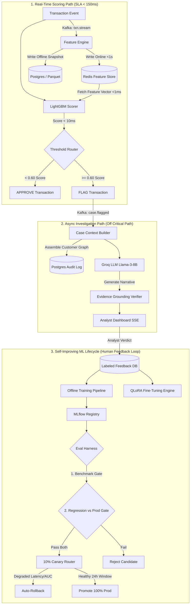
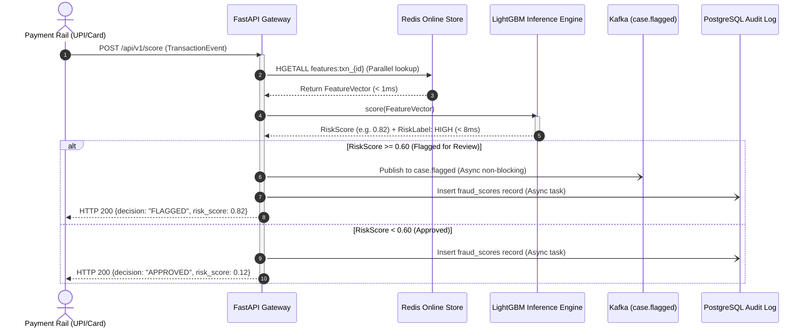
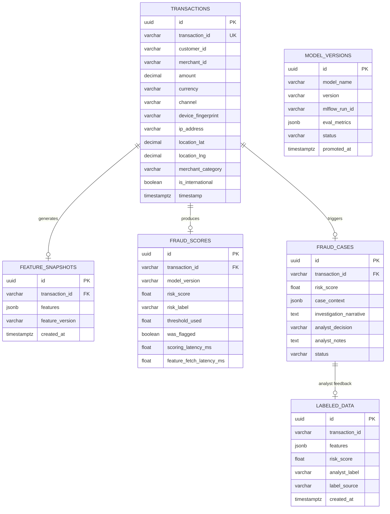

# SentinelForge — Low-Level Design (LLD) Specification

```
   _____            _   _            _ ______                    
  / ____|          | | (_)          | |  ____|                   
 | (___   ___ _ __ | |_ _ _ __   ___| | |__ ___  _ __ __ _  ___ 
  \___ \ / _ \ '_ \| __| | '_ \ / _ \ |  __/ _ \| '__/ _` |/ _ \
  ____) |  __/ | | | |_| | | | |  __/ | | | (_) | | | (_| |  __/
 |_____/ \___|_| |_|\__|_|_| |_|\___|_|_|  \___/|_|  \__, |\___|
                                                      __/ |     
                                                     |___/      
```

---

## Table of Contents
1. [Executive Summary & High-Level Architecture](#1-executive-summary--high-level-architecture)
2. [Data Flow & Sequence Diagrams](#2-data-flow--sequence-diagrams)
3. [Component-Level Architecture](#3-component-level-architecture)
   - [3.1 Layer 0: Shared Foundation & Infrastructure](#31-layer-0-shared-foundation--infrastructure)
   - [3.2 Layer 1: Ingestion & Transaction Simulation](#32-layer-1-ingestion--transaction-simulation)
   - [3.3 Layer 2: Streaming Feature Engine (Dual-Store)](#33-layer-2-streaming-feature-engine-dual-store)
   - [3.4 Layer 3: Synchronous ML Scoring (<150ms SLA)](#34-layer-3-synchronous-ml-scoring-150ms-sla)
   - [3.5 Layer 4: LLM Investigation Narrative Assist](#35-layer-4-llm-investigation-narrative-assist)
   - [3.6 Layer 5: FastAPI Gateway & SSE Streaming](#36-layer-5-fastapi-gateway--sse-streaming)
   - [3.7 Layer 6: Offline Training & Optuna Tuning](#37-layer-6-offline-training--optuna-tuning)
   - [3.8 Layer 7: QLoRA LLM Fine-Tuning Pipeline](#38-layer-7-qlora-llm-fine-tuning-pipeline)
   - [3.9 Layer 8: Eval-Gated Promotion & Canary Lifecycle](#39-layer-8-eval-gated-promotion--canary-lifecycle)
4. [Database Schema & Entity-Relationship Model](#4-database-schema--entity-relationship-model)
5. [Anti-Patterns Avoided & Key Trade-Offs](#5-anti-patterns-avoided--key-trade-offs)
6. [Phase-by-Phase Roadmap Status](#6-phase-by-phase-roadmap-status)

---

## 1. Executive Summary & High-Level Architecture

**SentinelForge** is a dual-path transaction fraud detection system that decouples **synchronous, latency-critical scoring (<150ms total budget, <10ms model inference)** from **asynchronous, evidence-grounded LLM narrative generation (3–5s budget)**, tied together with a self-improving ML lifecycle.



---

## 2. Data Flow & Sequence Diagrams

### 2.1 The Synchronous Authorization Flow (<150ms SLA)



---

## 3. Component-Level Architecture

### 3.1 Layer 0: Shared Foundation & Infrastructure
- **Settings & Config (`shared/config/settings.py`)**: Built on `pydantic-settings` with computed DSN properties (`DATABASE_URL`, `REDIS_URL`) and port isolation.
- **Port Strategy**:
  - PostgreSQL: **5433** (Mapped to internal 5432)
  - Redis: **6380** (Mapped to internal 6379)
  - Prometheus: **9091** (Scrape interval: 5s)
  - Grafana: **3002**
  - MLflow: **5001**
- **Observability (`shared/metrics/prometheus.py`)**:
  - `sentinelforge_scoring_latency_seconds`: Custom buckets `[1ms, 5ms, 10ms, 25ms, 50ms, 100ms, 150ms]`.
  - `sentinelforge_feature_fetch_latency_seconds`: Microsecond/millisecond tracking for Redis lookups.

### 3.2 Layer 1: Ingestion & Transaction Simulation
- **Simulator (`services/transaction_simulator/simulator.py`)**:
  - Models 1,000 synthetic customers with log-normal spending distributions ($(\mu=6.5, \sigma=0.6)$) and GPS home anchors.
  - Models 500 merchants across 10 distinct categories with baseline risk weights.
  - Generates 5 explicit fraud attack patterns:
    1. `velocity`: Burst frequency from same device.
    2. `amount_anomaly`: $10\times$ to $40\times$ baseline average spend.
    3. `geographic_anomaly`: Impossible travel ($>5000\text{ km}$ displacement or cross-border).
    4. `new_merchant`: High-risk categories (crypto, gambling, luxury).
    5. `card_not_present`: Credential stuffing from hijacked device fingerprint.

---

## 4. Database Schema & Entity-Relationship Model



---

## 5. Anti-Patterns Avoided & Key Trade-Offs

| Decision | Alternative Rejected | Why This Decision Wins |
| :--- | :--- | :--- |
| **LightGBM in Auth Path** | LLM in Auth Path | Hard 150ms SLA. LLM calls require 500ms–2000ms. LightGBM executes in <10ms. |
| **Unified Feature Definitions** | Ad-hoc SQL in batch vs Python in stream | Prevents **Training-Serving Skew** by compiling online and offline transforms from one definition file. |
| **Redis Sorted Sets for Velocity** | Stateful in-memory worker counters | Sorted sets survive worker restarts and allow atomic sliding-window range queries ($O(\log N)$). |
| **Two-Gate Promotion** | Benchmark eval only | Benchmarks miss edge-case regressions. Head-to-head regression testing against active prod catches subtle failures. |

---

## 6. Phase-by-Phase Roadmap Status

```
[██████████] Phase 1: Foundation & Shared Infrastructure (100% COMPLETE)
[██████████] Phase 2: Transaction Simulator & Synthetic Data (100% COMPLETE)
[░░░░░░░░░░] Phase 3: Streaming Feature Engine (NEXT)
[░░░░░░░░░░] Phase 4: Real-Time LightGBM Scoring
[░░░░░░░░░░] Phase 5: LLM Investigation Assist
[░░░░░░░░░░] Phase 6: FastAPI Gateway & SSE Dashboard
[░░░░░░░░░░] Phase 7: Model Training & Evaluation Harness
[░░░░░░░░░░] Phase 8: LLM Fine-Tuning Pipeline (QLoRA)
[░░░░░░░░░░] Phase 9: Model Lifecycle (Canary, Rollback, Drift Monitor)
[░░░░░░░░░░] Phase 10: Documentation & Polish
```
