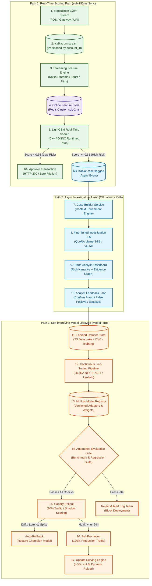

# SentinelForge Architecture — Comprehensive Block-by-Block Deep Dive

> **Project:** SentinelForge — Real-Time Transaction Fraud Detection with Self-Improving ML Lifecycle  
> **Target Latency:** Sub-150ms Synchronous Auth Path | Asynchronous Investigation & Autonomous Retraining Lifecycle

---

## 1. End-to-End System Architecture



---

## 2. Core Architectural Design Principles

1. **Strict Decoupling of Real-Time vs. Heavy Compute**:
   - **Real-Time Path**: Only uses sub-millisecond tree-based models (`LightGBM` / `XGBoost`) with precomputed Redis features. Hard limit: $\le 150\text{ms}$ (P99).
   - **LLM Path**: Never placed directly in the customer checkout path. It runs asynchronously to assist human analysts with complex investigation narratives, evidence synthesis, and SAR filing.
2. **Single Source of Truth Feature Store**:
   - Features computed during streaming are saved to Redis (online serving) and dumped to S3/Parquet (offline training) via the exact same feature definitions, eliminating **Training-Serving Skew**.
3. **Closed Feedback Flywheel**:
   - Every human analyst decision automatically writes back structured ground-truth labels to trigger continuous evaluation, drift checks, and scheduled model fine-tuning.
4. **Three-Tier Safety Promotion**:
   - No model goes live without clearing offline statistical regression tests, golden safety benchmarks, and real-time shadow/canary deployments with automated rollbacks.

---

## 3. Path 1: Real-Time Scoring Path (Latency Budget: $\le 150\text{ms}$)

```
[Customer Payment] ──► [Kafka] ──► [Feature Engine] ──► [Redis] ──► [LightGBM] ──► [Approve / Flag]
```

### Block 1: `TX` — Transaction Event Stream
- **What it is**: The raw transaction payload emitted immediately when a customer initiates a payment (POS terminal, payment gateway, e-commerce checkout, or UPI/ACH transfer).
- **Key Attributes**:
  - `transaction_id`: UUID
  - `account_id`, `card_id`, `merchant_id`
  - `amount`, `currency`
  - `timestamp_utc`, `location_lat_long`
  - `device_fingerprint`, `ip_address`
- **Purpose**: Acts as the single point of entry for live transaction authorization.

---

### Block 2: `KF` — Kafka Topic (`txn.stream`)
- **What it is**: Distributed, partitioned event log for ultra-high throughput event streaming.
- **Why it exists**:
  - Decouples transaction capture from downstream processing.
  - **Partitioning Strategy**: Partitioned by `account_id` or `card_id` to guarantee strict in-order processing for each user's chronological activity.
- **Latency**: $\approx 2 - 5\text{ms}$ write ack.

---

### Block 3: `FE` — Streaming Feature Engine (Kafka Streams / Faust / Apache Flink)
- **What it is**: Stateful streaming pipeline that processes raw transactions and continuously updates sliding time-window behavioral aggregations.
- **Features Computed On-The-Fly**:
  - Velocity counts: `txn_count_1m`, `txn_count_5m`, `txn_count_1h`, `txn_count_24h`
  - Financial velocity: `sum_amount_1h`, `max_amount_24h`, `stddev_amount_7d`
  - Behavioral anomalies: `distinct_merchant_categories_1h`, `geo_distance_from_last_txn_km`, `speed_kmh_since_last_txn` (impossible travel detection).
- **Purpose**: Raw data is insufficient to spot fraud; moving window aggregates expose anomalous spikes and coordinated attack patterns.

---

### Block 4: `OFS` — Online Feature Store (Redis Cluster)
- **What it is**: In-memory key-value cache hosting pre-aggregated entity feature vectors indexed by `account_id` and `device_id`.
- **Performance Characteristics**:
  - Sub-2 millisecond P99 read latency using Redis MGET / pipelined hash lookups.
  - TTL policies to automatically expire stale temporary counters.
- **Dual-Write Architecture**:
  - **Online**: Redis (for real-time inference lookup).
  - **Offline**: S3 Data Lake via Kafka Connect (for model training dataset generation).

---

### Block 5: `LGB` — LightGBM Real-Time Scorer
- **What it is**: Low-latency, tree-based gradient boosting classifier running inside C++ runtime, Triton Inference Server, or ONNX Runtime.
- **Why LightGBM instead of an LLM here?**:
  - Inference time is **sub-10ms** (vs. 500ms–2000ms for LLMs).
  - Exceptionally strong on structured, tabular, historical financial metrics.
  - Generates exact feature importances (SHAP values / split contributions) in real time.
- **Scoring Decision Logic**:
  - **Score $< 0.65$**: Low Risk $\rightarrow$ Route to `PASS` (Approve Transaction).
  - **Score $\ge 0.65$**: High Risk / Suspicious $\rightarrow$ Route to `FLAG` (Trigger Case Builder).

---

### Block 6A: `PASS` — Approve Transaction
- **What it is**: Returns an authorization confirmation to the payment gateway (HTTP 200 / ISO 8583 Approved).
- **Outcome**: Customer experiences zero friction; payment settles immediately.

---

### Block 6B: `FLAG` — Kafka Topic (`case.flagged`)
- **What it is**: An event topic holding flagged suspicious transactions along with their calculated fraud score, triggering features, and SHAP attribution values.
- **Outcome**: The payment is placed under step-up auth (OTP/2FA) or queued for analyst investigation without blocking the synchronous API pipeline.

---

## 4. Path 2: Async Investigation Assist (Off Latency Path)

```
[Flagged Event] ──► [Case Builder] ──► [Fine-Tuned LLM] ──► [Analyst UI] ──► [Human Decision]
```

### Block 7: `CB` — Case Builder Service
- **What it is**: An orchestration worker that consumes `case.flagged` events and gathers all contextual intelligence needed for a thorough fraud audit.
- **Data Aggregation**:
  - Retrieves customer profile and KYC tier (PostgreSQL / Core Banking DB).
  - Fetches 30-day historical transaction ledger and typical spending patterns.
  - Queries IP reputation, geolocation mismatch databases, and merchant risk categories.
  - Pulls top SHAP feature drivers from the LightGBM scoring engine.
- **Purpose**: Creates an enriched, comprehensive investigation dossier formatted into a structured prompt schema for the LLM.

---

### Block 8: `INV` — Fine-Tuned Investigation LLM (QLoRA Llama-3-8B / vLLM)
- **What it is**: Domain-adapted 8B parameter LLM fine-tuned specifically on historical fraud cases, regulatory audit notes, and Suspicious Activity Report (SAR) filings.
- **Why a Fine-Tuned LLM instead of a generic model?**:
  - Understood compliance taxonomy (AML, structuring, account takeover, card testing, synthetic identity).
  - Generates standardized executive summaries, anomalous pattern explanations, and structured JSON audit payloads.
  - Zero hallucination on transactional numbers and timestamps via strict grounding.
- **Output Artifacts**:
  1. *Executive Summary*: 2-3 sentence overview of the suspicious indicators.
  2. *Evidence Breakdown*: Bullet points linking anomalies (e.g., *"3 transactions across 2 countries within 12 minutes"*).
  3. *Draft SAR (Suspicious Activity Report)*: Pre-filled regulatory compliance filing.

---

### Block 9: `UI` — Fraud Analyst Dashboard
- **What it is**: Real-time web workbench (React / Next.js) where compliance and fraud analysts review flagged cases.
- **Information Rendered**:
  - Live Fraud Score & Risk Gauge.
  - Top contributing risk factors (SHAP waterfall chart).
  - LLM-generated incident summary and evidence chain.
  - Map of geographical velocity & device history.
  - One-click action buttons: `[Confirm Fraud & Block]`, `[False Positive - Whitelist]`, `[Escalate to AML Tier 2]`.

---

### Block 10: `FB` — Analyst Feedback Loop
- **What it is**: The human-in-the-loop decision capture point.
- **Captured Data**:
  - Final verdict (`Fraud`, `Legitimate`, `Account Takeover`, `Friendly Fraud`).
  - Analyst adjustments to the LLM narrative or categorization.
  - Timestamp, analyst ID, and audit tags.
- **Purpose**: Transforms human expertise into clean, verified ground truth labels to feed the self-improving training flywheel.

---

## 5. Path 3: Self-Improving Model Lifecycle (ModelForge)

```
[Analyst Feedback] ──► [Dataset Store] ──► [LoRA Training] ──► [Registry] ──► [Eval Gate] ──► [Canary 10%] ──► [Production]
```

### Block 11: `DS` — Labeled Dataset Store (S3 + DVC / Apache Iceberg)
- **What it is**: Version-controlled historical repository storing pair-wise datasets:
  - **Tabular Data**: Feature snapshots paired with verified fraud outcomes (for LightGBM).
  - **Textual Data**: Investigation case dossiers paired with analyst-validated narratives & SARs (for LLM).
- **Tooling**: DVC (Data Version Control) or Apache Iceberg for dataset lineage, time-travel queries, and reproducible training sets.

---

### Block 12: `FT` — Continuous Fine-Tuning Pipeline (QLoRA NF4 + PEFT / Unsloth)
- **What it is**: Automated training jobs triggered when $N$ new verified cases accumulate or on a weekly cadence.
- **Dual Training Routine**:
  1. **LightGBM Retraining**: Fast tree optimization on the latest balanced dataset (with focal loss / class weighting).
  2. **LLM LoRA Fine-Tuning**: 4-bit Quantized Low-Rank Adaptation (QLoRA) on rank matrices ($r=16, \alpha=32$) updating only $\approx 0.1\%$ of weights while freezing base model weights.

---

### Block 13: `REG` — MLflow Model Registry
- **What it is**: Centralized model artifact store and metadata tracking catalog.
- **Stores**:
  - Model binary artifacts (LoRA adapter weights, LightGBM `.booster` files).
  - Exact training hyperparameters, git commit hashes, and DVC dataset versions.
  - Stage tracking: `Candidate` $\rightarrow$ `Canary` $\rightarrow$ `Production` $\rightarrow$ `Archived`.

---

### Block 14: `EV` — Automated Evaluation Gate (Benchmark + Regression Suite)
- **What it is**: Automated CI/CD validation suite that tests candidate models against a curated "Golden Test Set" before any live deployment.
- **Evaluation Criteria**:
  - **LightGBM Criteria**:
    - $\text{PR-AUC} \ge \text{Production} - 0.005$
    - False Positive Rate at 95% Recall $\le 3.5\%$
    - P99 inference latency $\le 12\text{ms}$
  - **LLM Criteria**:
    - Hallucination rate on financial figures $= 0.0\%$ (Strict Regex/AST verification)
    - SAR regulatory formatting compliance score $\ge 98\%$
    - Semantic alignment score (ROUGE-L / BERTScore against senior analyst benchmark) $\ge 0.85$
- **Outcomes**:
  - **Pass**: Move to Canary Deployment (`CAN`).
  - **Fail**: Trigger Alert (`RJ`) and discard candidate adapter.

---

### Block 15: `CAN` — Canary Rollout (10% Traffic / Shadow Scoring)
- **What it is**: Controlled progressive deployment mechanism.
- **Execution**:
  - **10% Live Traffic** is scored by the Candidate Model; **90%** remains on the current Champion.
  - In shadow mode: Candidate scores in parallel without affecting end decisions to evaluate live latency and distribution shifts.
- **Safety Watchdogs**:
  - Real-time Prometheus/Grafana monitors tracking: P99 latency, score distribution shift (PSI), and error rates.

---

### Fallback 1: `RB` — Auto-Rollback Engine
- **Trigger**: If the Canary model shows a latency spike ($> 20\text{ms}$), anomalous distribution shift ($\text{PSI} > 0.25$), or sudden spike in analyst overrides.
- **Action**: Instantly routes 100% traffic back to the previous stable Champion model within seconds.

---

### Block 16: `FULL` — Full Promotion to Production
- **Trigger**: Candidate completes 24 hours in Canary with zero latency degradation and equal or higher precision/recall.
- **Action**: Model is marked as `Production Champion` in the MLflow registry.

---

### Block 17: `DM` — Dynamic Model Reloading
- **What it is**: Serving infrastructure (Triton / vLLM / ONNX) dynamically swaps in-memory weights/adapters with zero downtime and zero dropped requests.

---

## 6. Summary Comparison: Component Responsibilities

| Component / Block | Domain / Scope | Primary Technology | Latency Requirement | Critical Failure Safeguard |
|:---|:---|:---|:---|:---|
| **`TX` & `KF`** | Event Ingestion | Apache Kafka | $\le 5\text{ms}$ | Partitioning by `account_id` |
| **`FE`** | Feature Calculation | Faust / Kafka Streams | $\le 10\text{ms}$ | Sliding window stateful stores |
| **`OFS`** | Fast Feature Cache | Redis Cluster | $\le 2\text{ms}$ | Strict TTLs & replication |
| **`LGB`** | Real-Time Fraud Score | LightGBM / C++ ONNX | $\le 10\text{ms}$ | Fallback to rule engine on timeout |
| **`INV`** | Narrative & SAR Drafting | QLoRA Llama-3-8B | $1.5 - 3\text{s}$ (Async) | Strict JSON schema output & AST validation |
| **`UI` & `FB`** | Human Feedback Loop | React / Next.js | N/A (Interactive) | Mandatory audit tagging |
| **`DS` & `FT`** | Continuous Retraining | S3 + DVC + QLoRA | Batch (Hours) | Gradient clipping & low LR ($2e-4$) |
| **`EV` & `CAN`** | Model Promotion & Safety | MLflow + CI/CD + Canary | Automated Gate | Auto-rollback on PSI drift / latency spike |

---

## 7. The Closed-Loop Flywheel in Action

```
[Transactions Flow]
        │
        ▼
[LightGBM Scores] ──(Flagged Suspicious)──► [LLM Explains & Enriches]
                                                     │
                                                     ▼
                                            [Analyst Confirms/Corrects]
                                                     │
                                                     ▼
                                            [DVC Dataset Updates]
                                                     │
                                                     ▼
                                            [Automated QLoRA / LGB Retraining]
                                                     │
                                                     ▼
                                            [CI/CD Golden Eval Gate]
                                                     │
                                                     ▼
                                            [10% Canary ──► 100% Champion]
                                                     │
                                                     ▼
                                        (System is now smarter against new attack patterns)
```

**Key Takeaway**: Every analyst review directly enriches the training data, training ever-more resilient models that adapt to novel fraud patterns autonomously while preserving strict sub-150ms authorization SLAs.
